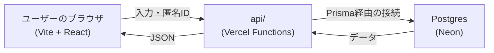

# 千葉さん向け不安解消アプリ

公務員試験の勉強中に感じる不安を、ポジティブな気持ちに変えるためのWebアプリです。

## 1. 何を作ったか

「今日も机に向かえたあなたへ」というひとことメッセージから始まり、その日の気分（不安・焦り・普通・前向き）をワンタップで選ぶチェックインと、今日感じている不安をひとこと入力する画面を用意しています。

入力した不安の内容に応じて、想定問答カードや、同じ不安を乗り越えた先輩合格者からのコメントを表示します。あわせてその日の勉強内容と勉強時間を記録すると、内容・時間に応じて合格率のバリエーション（例：3時間以上勉強で100%、30分で50%など）を出し、直近14日間の「積み上げ」を棒グラフで可視化します。ログインなどのアカウント機能は持たず、端末ごとに発行した匿名IDでデータを紐づけています。

技術構成は、フロントエンドがVite + React、APIはVercel Functions（`api/`フォルダ）、データベースはVercel経由のPostgres（実体はNeon）をPrisma経由で利用しています。ブラウザから直接データベースには接続せず、必ず`api/`のエンドポイントを経由します。

## 2. なぜ作ったか

ターゲットは、国家公務員を目指して勉強している20歳の学生「千葉さん」です。「このままで公務員試験にパスできるか」「面接で想定外の質問にうまく答えられるか」といった不安を、勉強の合間や寝る前にスマホで抱えがちだという課題がありました。

このアプリは、不安そのものを無くそうとするのではなく、努力の積み重ねを可視化し、前向きな一言や合格実績を返すことで、不安をポジティブな気持ちに変えることを目指しています。

開発の中では、次の2つの課題を優先して解決しました。

- **結果が毎回同じでは信頼されない**：どれだけ頑張った人にも頑張っていない人にも同じ内容が返ってくると、かえって不信感を抱かせてしまうと考え、勉強内容・勉強時間の組み合わせによって結果にバリエーションを持たせました。
- **積み上げが翌日に引き継がれない**：積み上げた努力で不安を解消したいはずなのに、その記録が消えてしまっては意味がありません。データベースに記録を保存し、2日目・3日目…と積み上げの継続を可視化できるようにしました。

## 3. 工夫した点

- **想定外の入力へのケア**：何も入力せずに進もうとした場合は「言葉にしたくない」なども含む選択肢を用意し、無理に言語化させない設計にしています。逆に200字を超える長文が入力された場合は、それを「不安の強さの表れ」として受け止める文言を添えつつ文字数を表示します。勉強時間が組み合わせの範囲外（例：秒単位の値が誤って入力された等）の場合も、結果を出さずに「もう少し頑張りましょう」という無理のない画面にフォールバックします。
- **継続を実感できる可視化**：ログインしなかった日は棒グラフ上でも記録なしの1本として扱い、間が自然に空くようにすることで、連続記録の有無がひと目でわかるようにしています。また3日以上・1週間以上といった節目ごとに応援メッセージを変化させ、続けるモチベーションにつなげています。
- **安全性への配慮**：データベースへの接続情報はすべて環境変数で管理し、コードやリポジトリには一切含めていません。ブラウザから直接データベースへアクセスする経路は存在せず、必ず`api/`のサーバー側処理を経由します。ユーザーが入力した自由記述のテキストは、結果画面の表示内容そのものには使わず、あらかじめ用意された文言を選ぶための判定材料としてのみ利用しています。

## セットアップ

```bash
npm install
cp .env.local.example .env.local  # Vercel Dashboard の値を設定
npm run dev
```

## 構成図


